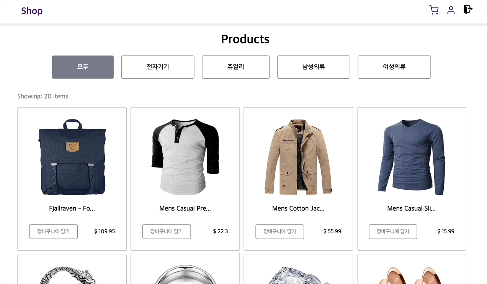

# React Shopping Mall



React와 TypeScript를 활용한 완전한 쇼핑몰 애플리케이션

## 📋 구현된 기능들

- [x] **Redux Toolkit을 이용한 상태 관리**
  - Auth state management (로그인/로그아웃)
  - Product state management (상품 목록)
  - Cart state management (장바구니)

- [x] **Firebase 인증 서비스**
  - 이메일/비밀번호 로그인
  - 회원가입
  - 자동 로그인 상태 유지

- [x] **TypeScript 완전 지원**
  - 모든 컴포넌트와 함수에 타입 정의
  - Redux state 타입 안정성

- [x] **FakeStore API 연동**
  - 실제 상품 데이터 가져오기 (https://fakestoreapi.com/products)
  - 비동기 데이터 로딩 처리

## 🚀 실행 방법

### 1. 패키지 설치
```bash
npm install
```

### 2. Firebase 설정
**보안상의 문제로 `.env` 파일은 리포지토리에 포함되지 않았습니다.**

프로젝트를 실행하기 위해서는 루트 디렉토리에 `.env` 파일을 생성하고 Firebase 프로젝트 생성 후 설정 정보를 입력해주세요:

```env
VITE_FIREBASE_API_KEY=your_api_key_here
VITE_FIREBASE_AUTH_DOMAIN=your_project_id.firebaseapp.com
VITE_FIREBASE_PROJECT_ID=your_project_id
VITE_FIREBASE_APP_ID=your_app_id
```

### 3. 개발 서버 실행
```bash
npm run dev
```

### 4. 빌드
```bash
npm run build
```

## 🛠 사용된 기술 스택

- **Frontend**: React 19, TypeScript
- **State Management**: Redux Toolkit
- **Authentication**: Firebase Auth
- **API**: FakeStore API
- **Build Tool**: Vite
- **Styling**: CSS3

## 📁 프로젝트 구조

```
src/
├── components/         # React 컴포넌트
│   ├── Header.tsx
│   ├── LoginModal.tsx
│   ├── ProductCard.tsx
│   ├── ProductList.tsx
│   └── Cart.tsx
├── store/             # Redux 상태 관리
│   ├── authSlice.ts
│   ├── productSlice.ts
│   ├── cartSlice.ts
│   └── index.ts
├── services/          # 외부 서비스 연동
│   ├── firebase.ts
│   └── authService.ts
├── types/            # TypeScript 타입 정의
│   └── index.ts
├── App.tsx
├── main.tsx
└── index.css
```

## ✨ 주요 기능

### 🔐 사용자 인증
- Firebase Authentication을 사용한 안전한 로그인/회원가입
- 자동 로그인 상태 유지
- 로그인 모달 UI

### 🛒 상품 관리
- FakeStore API에서 실시간 상품 데이터 로딩
- 상품 카드 UI with 이미지, 제목, 가격, 설명
- 반응형 그리드 레이아웃

### 🛍 장바구니
- 로그인한 사용자만 장바구니 이용 가능
- 상품 추가/삭제/수량 변경
- 실시간 총액 계산
- 장바구니 아이템 수 표시

## 🎯 향후 개선 사항

- [ ] 상품 카테고리 필터링
- [ ] 상품 검색 기능
- [ ] 결제 시스템 연동
- [ ] 주문 내역 관리
- [ ] 상품 상세 페이지
- [ ] 반응형 모바일 UI 개선